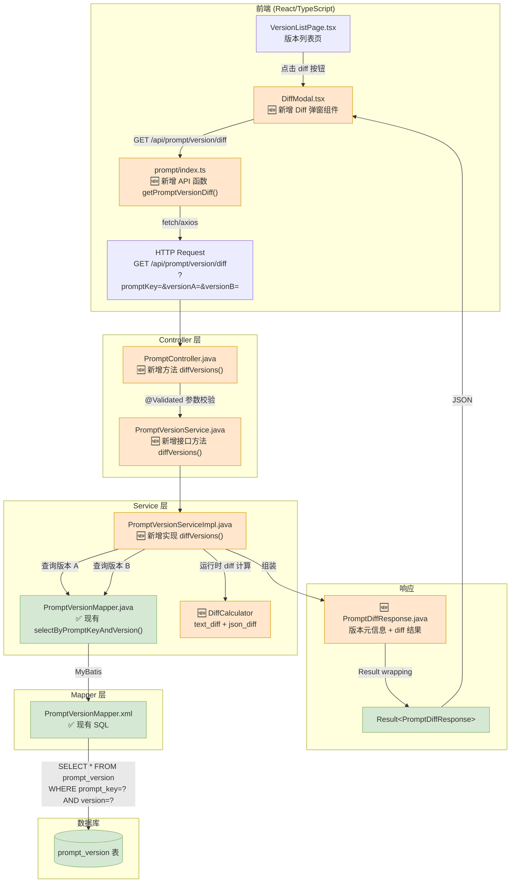

# Prompt 版本对比 — 改造链路分析

> 基于 `docs/requirements/prompt-version-diff.md` 需求定稿

## 一、完整调用链（Mermaid）



> 🟧 橙色 = 需要新增/修改的节点 — 共 **6 个**
> 🟩 绿色 = 现有节点直接复用 — 共 **5 个**

---

## 二、全链路节点明细

| # | 层 | 节点类型 | 文件 | 类/函数 | 方法 | 关键逻辑 | 状态 |
|---|----|---------|------|---------|------|----------|------|
| 1 | 前端 | UI 页面 | `pages/App/AssistantAppEdit/index.tsx` | `AssistantAppEdit` | — | 现有版本列表页，需增加"对比"按钮入口 | ✅ 现有（需加按钮） |
| 2 | 前端 | UI 组件 | `components/AppConfigDiffModal/index.tsx` | `AppConfigDiffModal` | — | 已存在的 diff 弹窗组件，需适配 Prompt 版本对比场景 | ✅ 现有（需适配） |
| 3 | 前端 | API 函数 | `legacy/services/prompt/index.ts` | — | `getPromptVersionDiff(params)` | 新增 fetch GET 请求到 `/api/prompt/version/diff` | 🆕 新增 |
| 4 | 前端 | 类型定义 | `legacy/services/prompt/typing.ts` | `PromptAPI` namespace | — | 新增 `GetPromptVersionDiffParams`、`PromptDiffResponse` 接口 | 🆕 新增 |
| 5 | 后端 | Controller | `PromptController.java` | `PromptController` | `diffVersions(@Validated PromptVersionDiffRequest)` | 参数校验 → 调 service → `Result<PromptDiffResponse>` 包裹返回 | 🆕 新增 |
| 6 | 后端 | Request DTO | `dto/request/PromptVersionDiffRequest.java` | `PromptVersionDiffRequest` | — | 三个字段：`@NotBlank promptKey` + `@NotBlank @Pattern versionA` + `@NotBlank @Pattern versionB` | 🆕 新增 |
| 7 | 后端 | Service 接口 | `service/PromptVersionService.java` | `PromptVersionService` | `diffVersions(PromptVersionDiffRequest)` | 接口声明 | 🆕 新增 |
| 8 | 后端 | Service 实现 | `service/impl/PromptVersionServiceImpl.java` | `PromptVersionServiceImpl` | `diffVersions(PromptVersionDiffRequest)` | ① 参数校验(versionA≠versionB) ② 两次查 DB ③ 调用 DiffCalculator ④ 组装元信息 ⑤ 返回 PromptDiffResponse | 🆕 新增 |
| 9 | 后端 | Diff 计算器 | `service/impl/DiffCalculator.java` | `DiffCalculator` | `textDiff(String, String)`, `jsonDiff(String, String)` | text 逐行比较 → segments 数组；JSON 解析 → addedKeys/removedKeys/changedKeys | 🆕 新增 |
| 10 | 后端 | Response DTO | `dto/PromptDiffResponse.java` | `PromptDiffResponse` | — | versionA 元信息 + versionB 元信息 + diff 结果 + summary | 🆕 新增 |
| 11 | 后端 | Mapper | `mapper/PromptVersionMapper.java` | `PromptVersionMapper` | `selectByPromptKeyAndVersion(String, String)` | 现有查询方法，diff 中调用 2 次 | ✅ 现有 |
| 12 | 后端 | Mapper XML | `mapper/PromptVersionMapper.xml` | — | `<select>` | `WHERE prompt_key=? AND version=?` | ✅ 现有 |
| 13 | 后端 | Entity | `entity/PromptVersionDO.java` | `PromptVersionDO` | — | template/variables/modelConfig/status/createTime/previousVersion | ✅ 现有 |
| 14 | 数据库 | 表 | — | `prompt_version` | — | 已存在的表，diff 只需 SELECT 不修改 | ✅ 现有 |
| 15 | 后端 | 异常 | `StudioException` | — | `NOT_FOUND` / `INVALID_PARAM` | 现有异常类型复用，无需新增错误码类 | ✅ 现有 |

---

## 三、改造工作量评估

### 3.1 后端（新增 6 个文件/方法）

| 节点 | 类型 | 预估行数 | 复杂度 |
|------|------|----------|--------|
| `PromptVersionDiffRequest.java` | 新建类 | ~30 行 | 低（纯 DTO） |
| `PromptController.diffVersions()` | 新增方法 | ~15 行 | 低（委托给 service） |
| `PromptVersionService.diffVersions()` | 新增接口 | ~5 行 | 低（接口声明） |
| `PromptVersionServiceImpl.diffVersions()` | 新增方法 | ~50 行 | 中（参数校验 + 两次 DB 查询 + 组装） |
| `DiffCalculator.java` | 新建类 | ~80 行 | 中（text diff 算法 + JSON diff 逻辑） |
| `PromptDiffResponse.java` | 新建类 | ~60 行 | 低（纯 DTO + summary 生成） |

**后端总计**：约 240 行 Java，0 行 SQL 变更（复用现有 Mapper），0 个表变更。

### 3.2 前端（修改 2 个文件，新增 1 个函数）

| 节点 | 类型 | 预估改动 | 复杂度 |
|------|------|----------|--------|
| `prompt/index.ts` | 新增 API 函数 | +15 行 | 低 |
| `prompt/typing.ts` | 新增类型定义 | +40 行 | 低 |
| `AssistantAppEdit/index.tsx` | 增加 diff 按钮 | +20 行 | 低 |
| `AppConfigDiffModal` | 适配 Prompt diff | +30 行（或直接复用现有逻辑） | 中 |

### 3.3 不需要修改的部分

- ❌ `prompt_version` 表结构（纯读操作）
- ❌ `PromptVersionMapper.xml`（查询逻辑已存在）
- ❌ `PromptVersionDO.java`（Entity 已覆盖所有字段）
- ❌ `NacosClientService`（diff 不涉及发布）
- ❌ 权限/认证（复用现有 Controller 层拦截器）
- ❌ 缓存（已决策不加缓存）

---

## 四、关键设计点

### 4.1 两次 DB 查询的性能

```java
// 并行无关，无需事务（只读），两次查询互相独立
PromptVersionDO versionA = mapper.selectByPromptKeyAndVersion(promptKey, versionA);
PromptVersionDO versionB = mapper.selectByPromptKeyAndVersion(promptKey, versionB);
```

每次查询走 `(prompt_key, version)` 联合索引（表上应有此索引），两次查询 < 10ms。

### 4.2 Diff 计算在 Service 层完成

```java
// 不在 Mapper 层做 SQL 级别的 diff（如 MySQL 的 GROUP_CONCAT + 子查询），
// 而是在 Java 层计算。理由：
// 1. template 是 LONGTEXT，SQL 内对比效率低且不可读
// 2. variables/modelConfig 是 JSON，需要解析后对比
// 3. 业务逻辑（null→空字符串、一层深度 JSON diff）在 Java 层更易维护
```

### 4.3 `previousVersion` 字段不做自动关联

`PromptVersionDO.previousVersion` 仅记录版本号字符串，diff 接口**不做自动跳转**（如未传 versionB 时自动用 previousVersion）。按需求定稿，下期才做"一键对比上一版"。

---

## 五、前后端接口对齐

| 前端调用 | 后端端点 | 入参 | 返回 |
|----------|----------|------|------|
| `getPromptVersionDiff({ promptKey, versionA, versionB })` | `GET /api/prompt/version/diff` | `?promptKey=&versionA=&versionB=` | `Result<PromptDiffResponse>` |
| （下期）`getPromptVersionDiff({ promptKey, versionB: 'latest' })` | 下期 | — | — |

---

## 六、改造点清单

### 6.1 汇总

| 类型 | 数量 |
|------|------|
| 🆕 新增 | 6 |
| ✏️ 修改 | 4 |
| 🧪 测试 | 3 |
| 📄 文档 | 2 |
| **合计** | **15** |

### 6.2 详细清单

#### 🆕 后端新增（3 个新文件）

| 编号 | 类型 | 文件 | 位置 | 改什么 |
|------|------|------|------|--------|
| **P01** | 🆕 新增 | `dto/request/PromptVersionDiffRequest.java` | `server-start/src/main/java/.../dto/request/`（新建） | 新增请求 DTO：三个字段 `promptKey`(@NotBlank)、`versionA`(@NotBlank @Pattern)、`versionB`(@NotBlank @Pattern)，对齐 `PromptVersionDO.version` 校验规则 |
| **P02** | 🆕 新增 | `dto/PromptDiffResponse.java` | `server-start/src/main/java/.../dto/`（新建） | 新增响应 DTO：`versionA`/`versionB` 元信息对象（含 version/status/creator/createdAt/versionDesc）+ `diff` 对象（含 template/variables/modelConfig）+ `summary` 字符串 |
| **P03** | 🆕 新增 | `service/impl/DiffCalculator.java` | `server-start/src/main/java/.../service/impl/`（新建） | 新增 diff 计算工具类：`textDiff(String a, String b)` 逐行比较返回 segments 数组（added/removed/unchanged），`jsonDiff(String a, String b)` 解析 JSON 返回 addedKeys/removedKeys/changedKeys |

#### ✏️ 后端修改（3 个现有文件）

| 编号 | 类型 | 文件 | 位置 | 改什么 |
|------|------|------|------|------|
| **P04** | ✏️ 修改 | `PromptController.java` | L45-L48 附近（现有方法之间） | 新增 `@GetMapping("/prompt/version/diff")` 方法：参数校验 → 调 `promptVersionService.diffVersions()` → `Result.success(response)` 返回 |
| **P05** | ✏️ 修改 | `PromptVersionService.java` | L20 附近（现有方法之间） | 新增接口方法 `PromptDiffResponse diffVersions(PromptVersionDiffRequest request)` |
| **P06** | ✏️ 修改 | `PromptVersionServiceImpl.java` | L105 附近（现有方法之后） | 新增 `diffVersions()` 实现：① 参数校验(versionA≠versionB) ② 两次 `mapper.selectByPromptKeyAndVersion()` ③ null 值处理(视同 "") ④ 调 `DiffCalculator.textDiff()` + `DiffCalculator.jsonDiff()` ⑤ 组装 `PromptDiffResponse` + 生成 summary |

#### ✏️ 前端修改（4 个现有文件）

| 编号 | 类型 | 文件 | 位置 | 改什么 |
|------|------|------|------|------|
| **P07** | ✏️ 修改 | `frontend/.../legacy/services/prompt/index.ts` | L40 附近 | 新增 `getPromptVersionDiff(params)` 函数，发 GET 请求到 `/api/prompt/version/diff`，接收 `GetPromptVersionDiffParams` 返回 `PromptDiffResponse` |
| **P08** | ✏️ 修改 | `frontend/.../legacy/services/prompt/typing.ts` | L80 附近 | 新增类型定义：`GetPromptVersionDiffParams`（promptKey/versionA/versionB）、`PromptDiffResponse`（versionA/versionB 元信息 + diff 结果）、`DiffSegment`、`JsonDiffResult` |
| **P09** | ✏️ 修改 | `frontend/.../pages/App/AssistantAppEdit/index.tsx` | 版本列表区域 | 在版本列表 row 操作列新增"对比"按钮，点击后打开 DiffModal 并传入选中版本号 |
| **P10** | ✏️ 修改 | `frontend/.../components/AppConfigDiffModal/index.tsx` | L1-L150 | 适配 DiffModal 支持 Prompt 版本对比模式：接收 `promptKey` + `versionA` + `versionB` 参数，调用 `getPromptVersionDiff()` 获取 diff 结果，渲染 template/variables/modelConfig 三栏差异 |

#### 🧪 测试（3 个新文件/方法）

| 编号 | 类型 | 文件 | 位置 | 改什么 |
|------|------|------|------|------|
| **P11** | 🧪 测试 | `PromptControllerTest.java` | `server-start/src/test/java/.../controller/` | 新增 3 个测试用例：① 正常 diff 返回 200 + 正确 diff 结构 ② 相同版本号返回 400 `PROMPT_SAME_VERSION` ③ 不存在版本返回 404 `PROMPT_VERSION_NOT_FOUND` |
| **P12** | 🧪 测试 | `DiffCalculatorTest.java` | `server-start/src/test/java/.../service/impl/`（新建） | 新增单元测试 5 个用例：① 完全相同文本→无差异 ② 单行新增 ③ 单行删除 ④ null vs 空字符串→无差异 ⑤ JSON 键新增/删除/变更 |
| **P13** | 🧪 测试 | `PromptVersionServiceImplTest.java` | `server-start/src/test/java/.../service/impl/` | 新增 2 个测试用例：① `diffVersions()` 正常流程 mock Mapper 验证返回结构 ② `diffVersions()` versionA 不存在抛 `NOT_FOUND` 异常 |

#### 📄 文档（2 个现有文件）

| 编号 | 类型 | 文件 | 位置 | 改什么 |
|------|------|------|------|------|
| **P14** | 📄 文档 | `docs/api-list.md` | §17 Prompt 工程章节末尾 | 在 Prompt 接口表格中新增一行：`GET /api/prompt/version/diff` — Prompt 版本对比（diff） |
| **P15** | 📄 文档 | `docs/requirements/prompt-version-diff-impact.md` | 本文件 | 实现完成后将各改造点标记为完成状态 |

---

### 6.3 实施顺序建议

```
第1步: P01 + P02 (DTO)       → 数据结构先行，Controller/Service 可编译
第2步: P03 (DiffCalculator)   → diff 核心逻辑独立，可单独测试
第3步: P05 + P06 (Service)   → 业务逻辑编排
第4步: P04 (Controller)       → HTTP 入口
第5步: P11 P12 P13 (测试)    → 后端自测通过
第6步: P07 P08 (前端 API)    → 前端 API 层
第7步: P09 P10 (前端 UI)     → 前端界面
第8步: P14 (文档)            → 更新接口清单
```

---

## 七、影响范围分析

### 7.1 总览

| 维度 | 风险等级 | 一句话 |
|------|----------|--------|
| 现有接口 | 🟢 低 | 纯新增端点，0 个现有接口被修改 |
| 现有调用链路 | 🟢 低 | Service/Mapper 只加新方法，不改已有签名 |
| 测试 | 🟢 低 | 现有测试无需修改，仅新增 3 个测试 |
| 文档 | 🟢 低 | 仅 api-list.md 新增 1 行 |
| 前端兼容性 | 🟢 低 | 无新 npm 依赖，DiffModal 已有 diff 渲染能力 |
| 性能 | 🟡 中 | LONGTEXT 大模板场景需关注网络传输和序列化 |

### 7.2 逐项分析

#### 7.2.1 现有接口影响（🟢 低）

| 接口 | 是否影响 | 判断依据 |
|------|----------|----------|
| `GET /api/prompt/versions` | ❌ 不影响 | 版本列表接口，diff 不改变其分页/过滤逻辑 |
| `GET /api/prompt/version` | ❌ 不影响 | 单版本详情接口，diff 是两个版本的独立查询组合，不改变详情的 SQL 或返回结构 |
| `POST /api/prompt/version` | ❌ 不影响 | 版本创建接口，diff 不涉及状态机或 `previousVersion` 字段写入 |
| `POST /api/prompt/run` | ❌ 不影响 | 调试运行接口，diff 不涉及 ChatSession 或模型调用 |
| `GET /api/prompt/session` | ❌ 不影响 | 会话管理接口，diff 无关联 |
| `GET /api/prompt/version/diff` | 🆕 **新增** | 本需求唯一新增的端点，完全独立 |

> **结论**：0 个现有接口被修改。新端点 `/api/prompt/version/diff` 与现有 13 个 Prompt 接口完全正交。

#### 7.2.2 现有调用链路影响（🟢 低）

| 现有调用方 | 是否影响 | 判断依据 |
|------------|----------|----------|
| `PromptController.createPromptVersion()` | ❌ 不影响 | 调用 `promptVersionService.create()`，签名不变 |
| `PromptController.getPromptVersion()` | ❌ 不影响 | 调用 `promptVersionService.getByPromptKeyAndVersion()`，签名不变 |
| `PromptController.listPromptVersions()` | ❌ 不影响 | 调用 `promptVersionService.list()`，签名不变 |
| `PromptVersionServiceImpl.create()` | ❌ 不影响 | 方法签名不变，内部逻辑不变。`previousVersion` 字段仍然由 `create()` 自动填充，不依赖 diff |
| `PromptVersionServiceImpl.publishPromptToNacos()` | ❌ 不影响 | 发布逻辑与 diff 无关 |
| `AppComponentController` / `WorkflowController` 等 | ❌ 不影响 | 这些 Controller 不引用 `PromptVersionService` |
| 前端 `getPromptVersions()` / `getPromptVersion()` | ❌ 不影响 | 前端现有 API 函数不改变 |

> **结论**：`PromptVersionService` 只新增 `diffVersions()` 方法，不改变任何已有方法签名。Spring DI 自动注入新方法，调用方完全无感。

#### 7.2.3 测试影响（🟢 低）

| 现有测试 | 是否需改 | 判断依据 |
|----------|----------|----------|
| `PromptControllerTest` 现有用例 | ❌ 不改 | 现有端点测试不变，只新增 3 个 diff 用例（P11） |
| `PromptVersionServiceImplTest` 现有用例 | ❌ 不改 | `create()` / `getByPromptKeyAndVersion()` / `list()` 的 mock 和断言不变 |
| `DiffCalculatorTest` | 🆕 新建 | P12，5 个单元测试，不涉及现有测试 |
| 集成测试 / E2E 测试 | ❌ 不改 | diff 是纯读操作，不影响数据状态 |

> **结论**：现有测试 0 改动，新增 3 个测试类（P11-P13），覆盖 diff 的三个关键路径。

#### 7.2.4 文档影响（🟢 低）

| 文档 | 是否更新 | 改什么 |
|------|----------|--------|
| `docs/api-list.md` | ✅ 需更新（P14） | §17 Prompt 工程表格新增 1 行：`GET /api/prompt/version/diff` |
| `docs/data-model.md` | ❌ 不改 | 无表结构变更，不需要更新字段清单或枚举表 |
| `docs/data-model-er.svg` | ❌ 不改 | ER 图无变化 |
| `docs/CLAUDE.md` | ❌ 不改 | 项目约定无变化，📎 文档索引可以不更新（需求文档不算核心资产） |
| `docs/external-deps.svg` | ❌ 不改 | 无新增外部依赖 |
| `docs/env-checklist.md` | ❌ 不改 | 环境依赖无变化 |

> **结论**：仅 `api-list.md` 新增 1 行接口记录，其余 5 份资产均无变化。

#### 7.2.5 前端兼容性（🟢 低）

| 影响面 | 是否影响 | 判断依据 |
|--------|----------|----------|
| **npm 依赖** | ❌ 无新增 | diff 功能纯前端渲染，不需要 `diff` / `jsdiff` 等第三方库。后端返回 segments 数组，前端直接渲染 |
| **现有 API 函数** | ❌ 不影响 | `getPromptVersionDiff()` 是新增函数，不改变 `getPromptVersions()` 等现有函数的签名或行为 |
| **现有 TypeScript 类型** | ❌ 不影响 | `PromptDiffResponse` 是新增 interface，不修改现有 `PromptVersion` / `PromptVersionDetail` 类型 |
| **现有 UI 组件** | ⚠️ 轻微 | `AppConfigDiffModal` 已有 diff 渲染逻辑（用于 App 配置对比），需适配 Prompt 版本对比的入参和渲染模式。但组件本身支持多种 diff 类型，改动量不大 |
| **路由** | ❌ 不影响 | Diff 以弹窗形态嵌入版本列表页，不新增路由 |
| **状态管理** | ❌ 不影响 | Diff 结果不入 store，仅弹窗内展示 |

> **结论**：无新 npm 依赖，现有 API 函数/类型/路由/状态全不受影响。仅 `AppConfigDiffModal` 需适度适配。

#### 7.2.6 性能影响（🟡 中）

| 场景 | 风险 | 分析 |
|------|------|------|
| **正常模板**（<10KB） | 🟢 低 | 两次索引查询 <10ms + diff 计算 <5ms + JSON 序列化 <5ms。整体 <20ms |
| **大模板**（100KB+ LONGTEXT） | 🟡 中 | 模板 100KB → 逐行 diff 约 50ms；网络传输 100KB JSON → 带宽消耗显著。但 GET 请求响应体可 gzip（项目已配置 `server.compression.enabled=true`，`min-response-size=2048`，大于 2KB 自动压缩），100KB JSON 压缩后约 15-20KB |
| **极端模板**（1MB+ LONGTEXT） | 🔴 高 | 逐行 diff 算法 O(n) 约 500ms；传输未压缩 1MB → 可接受但触达体验边界。需产品确认是否需要前端分页渲染（本次决策不做大小限制，见 E06） |
| **高并发** | 🟢 低 | diff 是纯读操作，无锁、无事务。2 次 SELECT 走联合索引。当前 prompt_version 表预估 <10 万条，无并发瓶颈 |
| **variables/modelConfig JSON** | 🟢 低 | 这两个字段 <1KB 常见，JSON parse 耗时 <1ms |
| **GC 压力** | 🟢 低 | Diff 过程只创建临时 String 和 List 对象，方法结束后即可回收。无缓存，不产生常驻内存 |

**关键缓解措施：**
- `server.compression.enabled=true` 已开启 gzip，100KB 响应压缩到 ~15KB
- 两次 SELECT 走 `(prompt_key, version)` 联合索引，MySQL 查询 <10ms
- 无事务、无锁、无写入，纯读链路无阻塞

> **结论**：正常场景（<10KB 模板）性能无影响。大模板场景（100KB+）需关注网络传输，但 gzip 压缩和联合索引查询已有充分保障。极端场景（1MB+）需要前端分页渲染（留到下期）。

### 7.3 风险矩阵

```
              影响面
            小    中    大
          ┌─────┬─────┬─────┐
风险  高  │     │     │     │
      中  │     │  🟡  │     │
      低  │ 🟢🟢🟢🟢🟢│     │     │
          │ 🟢 │     │     │
          └─────┴─────┴─────┘
```

- 🟢 低风险低影响 × 5：现有接口、调用链路、测试、文档、前端兼容
- 🟡 中风险低影响 × 1：大模板性能

---

## 八、实施计划

### 8.1 步骤总览

| 步序 | 编号 | 做什么 | 依赖 | 预估工作量 |
|------|------|--------|------|------------|
| S1 | P01+P02 | 新建 `PromptVersionDiffRequest.java` + `PromptDiffResponse.java` | 无 | 15 min |
| S2 | P03 | 新建 `DiffCalculator.java` | S1（需知道返回的 diff 结构） | 30 min |
| S3 | P05 | 修改 `PromptVersionService.java` 新增接口方法 | S1 | 5 min |
| S4 | P06 | 修改 `PromptVersionServiceImpl.java` 新增实现 | S1, S2, S3 | 25 min |
| S5 | P12 | 新建 `DiffCalculatorTest.java` | S2 | 20 min |
| S6 | P04 | 修改 `PromptController.java` 新增端点 | S4 | 10 min |
| S7 | P13 | 新建/修改 `PromptVersionServiceImplTest.java` | S4 | 15 min |
| S8 | P11 | 修改 `PromptControllerTest.java` | S6 | 15 min |
| S9 | P08 | 修改 `typing.ts` 新增类型定义 | 无 | 15 min |
| S10 | P07 | 修改 `prompt/index.ts` 新增 API 函数 | S9 | 10 min |
| S11 | P09+P10 | 修改版本列表 + 适配 DiffModal | S10（后端接口可用） | 40 min |
| S12 | P14 | 更新 `docs/api-list.md` | S6 | 5 min |

**总预估**：~3.5 小时（后端 2h + 前端 1h + 测试 30min）

### 8.2 详细步骤

#### S1：DTO 层（P01 + P02）— 15 min

```
做什么：创建两个新 Java 文件
  - PromptVersionDiffRequest.java（三个 @NotBlank + @Pattern 字段）
  - PromptDiffResponse.java（versionA/B 元信息 + DiffResult + summary）

依赖：无
位置：
  server-start/src/main/java/.../dto/request/PromptVersionDiffRequest.java
  server-start/src/main/java/.../dto/PromptDiffResponse.java
```

#### S2：DiffCalculator（P03）— 30 min

```
做什么：创建 DiffCalculator.java
  - textDiff(String a, String b) → List<DiffSegment>
    · null 视为 ""
    · 逐行 split("\n") 后线性扫描
    · 输出 segments：{type: "added"|"removed"|"unchanged", content: "..."}
  - jsonDiff(String a, String b) → JsonDiffResult
    · null 或 "" 视为 {}
    · JSON.parse 后取 keySet，一层深度对比
    · 输出 addedKeys / removedKeys / changedKeys[{key, oldValue, newValue}]

依赖：S1（已知 DiffSegment 和 JsonDiffResult 的结构）

关键决策点 #1 — null 转空字符串放哪里？
  方案A：在 DiffCalculator 内部处理        ← 纯函数，任何调用方都统一行为
  方案B：在 Service 层调用前处理           ← 灵活性更高，但 DiffCalculator 不完整
  ✅ 推荐方案A：null 转空在 DiffCalculator 内部统一处理。
     理由：null 处理是 diff 计算的固有语义（"无内容" = "空内容"），
     不是调用方的业务策略。且只有一个调用方，灵活性无收益。
```

#### S3：Service 接口（P05）— 5 min

```
做什么：在 PromptVersionService.java 中新增一行接口声明
  PromptDiffResponse diffVersions(PromptVersionDiffRequest request);

依赖：S1
```

#### S4：Service 实现（P06）— 25 min

```
做什么：在 PromptVersionServiceImpl.java 中新增 diffVersions() 方法
  ① 校验 versionA != versionB → INVALID_PARAM
  ② mapper.selectByPromptKeyAndVersion(key, versionA) → DO a
  ③ mapper.selectByPromptKeyAndVersion(key, versionB) → DO b
  ④ a 或 b 为 null → NOT_FOUND
  ⑤ DiffCalculator.textDiff(a.template, b.template)
  ⑥ DiffCalculator.jsonDiff(a.variables, b.variables)
  ⑦ DiffCalculator.jsonDiff(a.modelConfig, b.modelConfig)
  ⑧ 组装 PromptDiffResponse + 生成 summary 字符串

依赖：S1, S2, S3

关键决策点 #2 — 两次 DB 查询顺序 vs 并行？
  方案A：顺序查询（先查 A 再查 B）
  方案B：CompletableFuture 并行查询
  ✅ 推荐方案A：顺序查询。
     理由：两次查询都走联合索引 <5ms 每条，并行节省的 5ms 不抵线程池开销。
     代码也更简单、异常处理更清晰。

关键决策点 #3 — summary 字符串生成策略？
  方案A：Service 层硬编码格式        ← 简单，中文模板不变
  方案B：独立 SummaryBuilder 类      ← 过度设计
  ✅ 推荐方案A：直接在 Service 中用 String.format 拼接。
     理由：summary 格式稳定（template: +X -X行; variables: +X键; modelConfig: 无变更），
     不需要独立的 builder 类。
```

#### S5：DiffCalculator 测试（P12）— 20 min

```
做什么：新建 DiffCalculatorTest.java，5 个用例
  ① testTextDiff_identical → 完全相同文本返回 1 个 unchanged segment
  ② testTextDiff_added → 新增一行 → segments 含 1 unchanged + 1 added
  ③ testTextDiff_removed → 删除一行 → segments 含 1 unchanged + 1 removed
  ④ testTextDiff_null → null vs "" → 都是空，无差异
  ⑤ testJsonDiff → JSON 键新增/删除/变更 → addedKeys/removedKeys/changedKeys 正确

依赖：S2
```

#### S6：Controller 端点（P04）— 10 min

```
做什么：在 PromptController.java 中新增方法
  @GetMapping("/prompt/version/diff")
  public Result<PromptDiffResponse> diffVersions(
      @Validated PromptVersionDiffRequest request) {
      return Result.success(promptVersionService.diffVersions(request));
  }

依赖：S4
```

#### S7：Service 测试（P13）— 15 min

```
做什么：在 PromptVersionServiceImplTest.java 中新增 2 个用例
  ① testDiffVersions_success → mock mapper 返回两个 DO，验证 PromptDiffResponse 结构
  ② testDiffVersions_notFound → mock mapper 返回 null，验证抛 NOT_FOUND

依赖：S4
```

#### S8：Controller 测试（P11）— 15 min

```
做什么：在 PromptControllerTest.java 中新增 3 个用例
  ① testDiffVersions_200 → 正常请求返回 200 + 正确 JSON 结构
  ② testDiffVersions_400 → versionA == versionB 返回 400
  ③ testDiffVersions_404 → 不存在的版本返回 404

依赖：S6
```

#### S9：前端类型定义（P08）— 15 min

```
做什么：在 typing.ts 中新增 TypeScript 接口
  GetPromptVersionDiffParams { promptKey, versionA, versionB }
  PromptDiffResponse { versionA, versionB, diff, summary }
  VersionMeta { version, status, creator, createdAt, versionDesc }
  DiffResult { template: TextDiffResult, variables: JsonDiffResult, modelConfig: JsonDiffResult }
  DiffSegment { type: "added"|"removed"|"unchanged", content: string }

依赖：无
```

#### S10：前端 API 函数（P07）— 10 min

```
做什么：在 prompt/index.ts 中新增函数
  export async function getPromptVersionDiff(params: GetPromptVersionDiffParams):
    Promise<AxiosResponse<Result<PromptDiffResponse>>> {
    return axios.get(`${BASE_URL}/api/prompt/version/diff`, { params })
  }

依赖：S9
```

#### S11：前端 UI（P09 + P10）— 40 min

```
做什么：
  ① 版本列表页（P09）：操作列新增"对比"按钮
     - 默认对比模式：选中两个版本后激活按钮
     - 点击后打开 DiffModal 弹窗，传入 promptKey + versionA + versionB
  ② DiffModal 适配（P10）：
     - 已有 AppConfigDiffModal 组件，新增 Prompt 版本对比模式
     - 调用 getPromptVersionDiff() 获取数据
     - template 渲染：segments 数组逐行渲染，绿色/红色/默认色
     - variables 渲染：addedKeys/removedKeys/changedKeys 表格
     - modelConfig 渲染：同 variables 逻辑

依赖：S10（后端接口已可用）
```

#### S12：文档更新（P14）— 5 min

```
做什么：在 docs/api-list.md §17 表格中新增一行
  | GET | /api/prompt/version/diff | Prompt 版本对比（diff） |

依赖：S6
```

### 8.3 依赖关系图

```
S1 (DTO)
 ├─→ S2 (DiffCalculator) ──→ S5 (DiffCalculator 测试)
 ├─→ S3 (Service 接口) ──→ S4 (Service 实现) ──→ S6 (Controller)
 │                              │                    │
 │                              ├─→ S7 (Service 测试)├─→ S8 (Controller 测试)
 │                              │                    │
 │                              │                    └─→ S12 (文档)
 │                              │
 └──────────────────────────────┘

S9 (前端类型) ──→ S10 (前端 API) ──→ S11 (前端 UI)
```

### 8.4 关键决策点汇总

| # | 决策点 | 选项 | 选择 | 理由 |
|---|--------|------|------|------|
| D1 | null→空转换位置 | A: DiffCalculator 内部 / B: Service 层 | **A** | 纯函数语义，调用方统一行为 |
| D2 | DB 查询顺序 vs 并行 | A: 顺序 / B: CompletableFuture | **A** | 单次 <5ms，并行开销抵不掉收益 |
| D3 | summary 生成方式 | A: Service 硬编码 / B: Builder 类 | **A** | 格式稳定，独立类过度设计 |
| D4 | text diff 算法 | A: 逐行线性扫描 / B: Myers diff | **A** | 同一 Prompt 的两个版本差异小，线性扫描足够 |
| D5 | JSON diff 深度 | A: 一层根级 / B: 递归深度 | **A** | 需求已定稿，一层深度 |
| D6 | 模板 null vs "" | A: 视同 / B: 区分 | **A** | 边界决策 E04 已定 |
| D7 | 软删除 Prompt 查 diff | A: 允许 / B: 拒绝 | **A** | 边界决策 E07 已定 |
| D8 | 大小写处理 | A: 应用层不处理 / B: toLowerCase | **A** | 边界决策 E11 已定，依赖 DB collation |
