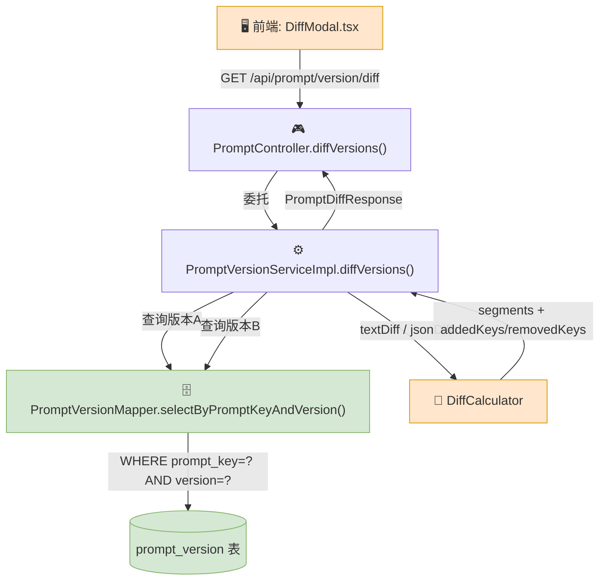

# Prompt 版本对比 — 改造方案

> **一句话概要**：在现有 Prompt 版本管理体系中新增 `GET /api/prompt/version/diff` 接口，支持两个版本之间 template/variables/modelConfig 的内容差异对比，纯读操作，0 表变更，0 现有接口影响，总工作量 ~3.5 小时。

> 方案来源：六维需求定稿 → 链路分析 → 改造点拆解 → 流程图 → 影响范围评估 → 实施计划
>
> 详细文档：[需求定稿](prompt-version-diff.md) · [改造点+影响+计划](prompt-version-diff-impact.md) · [流程图](prompt-version-diff-flow.md)

---

## 一、涉及链路

### 1.1 链路图

### 1.2 节点明细

| # | 层 | 节点 | 文件 | 状态 |
|---|----|------|------|------|
| 1 | 前端 | `DiffModal.tsx` — diff 弹窗组件 | `components/AppConfigDiffModal/index.tsx` | ✏️ 适配 |
| 2 | 前端 | `getPromptVersionDiff()` — API 函数 | `legacy/services/prompt/index.ts` | 🆕 新增 |
| 3 | 后端 | `diffVersions()` — Controller 端点 | `controller/PromptController.java` | 🆕 新增 |
| 4 | 后端 | `diffVersions()` — Service 实现 | `service/impl/PromptVersionServiceImpl.java` | 🆕 新增 |
| 5 | 后端 | `DiffCalculator` — 核心计算 | `service/impl/DiffCalculator.java` | 🆕 新增（新文件） |
| 6 | 后端 | `selectByPromptKeyAndVersion()` — 查询 | `mapper/PromptVersionMapper.java` | ✅ 复用 |
| 7 | 数据库 | `prompt_version` 表 | — | ✅ 不改表 |

---

## 二、改造点清单

### 2.1 🆕 后端新增（3 个文件）

| 编号 | 文件 | 改什么 |
|------|------|--------|
| P01 | `dto/request/PromptVersionDiffRequest.java` | 请求 DTO：`promptKey`(@NotBlank)、`versionA`(@NotBlank @Pattern)、`versionB`(@NotBlank @Pattern) |
| P02 | `dto/PromptDiffResponse.java` | 响应 DTO：`versionA/B` 元信息 + `diff` 对象(template/variables/modelConfig) + `summary` |
| P03 | `service/impl/DiffCalculator.java` | `textDiff(s1,s2)→List<DiffSegment>` + `jsonDiff(s1,s2)→JsonDiffResult` |

### 2.2 ✏️ 后端修改（3 个文件）

| 编号 | 文件 | 改什么 |
|------|------|--------|
| P04 | `controller/PromptController.java` | 新增 `@GetMapping("/prompt/version/diff")` 方法 |
| P05 | `service/PromptVersionService.java` | 新增接口方法 `PromptDiffResponse diffVersions(...)` |
| P06 | `service/impl/PromptVersionServiceImpl.java` | 新增 `diffVersions()` 实现：2次查询 → diff计算 → 组装响应 |

### 2.3 ✏️ 前端修改（4 个文件）

| 编号 | 文件 | 改什么 |
|------|------|--------|
| P07 | `legacy/services/prompt/index.ts` | 新增 `getPromptVersionDiff()` 函数 |
| P08 | `legacy/services/prompt/typing.ts` | 新增 `GetPromptVersionDiffParams`、`PromptDiffResponse` 等类型 |
| P09 | `pages/App/AssistantAppEdit/index.tsx` | 版本列表操作列新增"对比"按钮 |
| P10 | `components/AppConfigDiffModal/index.tsx` | 适配 Prompt 版本对比模式（入参+渲染） |

### 2.4 🧪 测试（3 个）

| 编号 | 文件 | 用例数 | 覆盖 |
|------|------|--------|------|
| P11 | `PromptControllerTest.java` | 3 | 正常diff(200)、同版本(400)、不存在(404) |
| P12 | `DiffCalculatorTest.java`（新文件） | 5 | 完全一致、新增、删除、null、JSON变更 |
| P13 | `PromptVersionServiceImplTest.java` | 2 | mock正常流程、mock异常(NOT_FOUND) |

### 2.5 📄 文档（1 个）

| 编号 | 文件 | 改什么 |
|------|------|--------|
| P14 | `docs/api-list.md` §17 | 新增 1 行：`GET /api/prompt/version/diff` |

---

## 三、改造流程图

> 详见独立文件：[prompt-version-diff-flow.md](prompt-version-diff-flow.md)

**核心流程**：用户选两个版本 → 前端 `getPromptVersionDiff()` → `GET /api/prompt/version/diff` → Controller 校验 → Service 两次查询 DB → DiffCalculator 计算三段 diff → 组装 `PromptDiffResponse` → 前端 DiffModal 渲染。

⚠️ **本次改造不改表**：`prompt_version` 十列结构不变，复用现有 `(prompt_key, version)` 联合索引，纯读无锁无事务。

---

## 四、影响范围与风险

| 维度 | 风险 | 判断 |
|------|------|------|
| 现有接口 | 🟢 低 | 纯新增端点，0 个现有接口被修改 |
| 调用链路 | 🟢 低 | Service/Mapper 只加新方法不改签名，DI 自动注入无感 |
| 测试 | 🟢 低 | 现有测试 0 改动，新增 3 个测试 |
| 文档 | 🟢 低 | 仅 api-list.md 新增 1 行 |
| 前端兼容 | 🟢 低 | 无新 npm 依赖，DiffModal 已有 diff 渲染能力 |
| 性能 | 🟡 中 | 正常模板 <20ms。大模板(100KB+)依赖 gzip 压缩缓解（已启用，100KB→15KB），极端 1MB+ 留到下期分页渲染 |

---

## 五、改造步骤与顺序

| 步序 | 编号 | 做什么 | 依赖 | 预估 |
|------|------|--------|------|------|
| S1 | P01+P02 | 新建 DTO（DiffRequest + DiffResponse） | 无 | 15 min |
| S2 | P03 | 新建 DiffCalculator（textDiff + jsonDiff） | S1 | 30 min |
| S3 | P05 | 修改 PromptVersionService 接口 | S1 | 5 min |
| S4 | P06 | 修改 PromptVersionServiceImpl 实现 | S1,S2,S3 | 25 min |
| S5 | P12 | 新建 DiffCalculatorTest（5 用例） | S2 | 20 min |
| S6 | P04 | 修改 PromptController 新增端点 | S4 | 10 min |
| S7 | P13 | 修改 PromptVersionServiceImplTest（2 用例） | S4 | 15 min |
| S8 | P11 | 修改 PromptControllerTest（3 用例） | S6 | 15 min |
| S9 | P08 | 修改前端 typing.ts 类型定义 | 无 | 15 min |
| S10 | P07 | 修改前端 prompt/index.ts API 函数 | S9 | 10 min |
| S11 | P09+P10 | 改造版本列表 + DiffModal | S10 | 40 min |
| S12 | P14 | 更新 docs/api-list.md | S6 | 5 min |

**依赖关系**：S1→S2→S4→S6（后端 DTO→DiffCalc→Service→Controller），S9→S10→S11（前端类型→API→UI），测试 S5/S7/S8 穿插在后端各层完成后。

---

## 六、待审核的关键决策点

> 以下决策是在需求分析、链路分析、影响评估过程中做出的判断。集中列在这里方便一次性审核。

| # | 决策点 | 选择 | 理由 | 影响范围 |
|---|--------|------|------|----------|
| **D1** | template 为 null 怎么处理 | **视同空字符串** | DiffCalculator 内部统一处理，"无内容" = "空内容" | DiffCalculator.textDiff() |
| **D2** | 软删除的 Prompt 是否允许查 diff | **允许** | 团队需要回溯已下线 Prompt 的历史变更 | Controller 不做软删除检查 |
| **D3** | 大模板是否做大小限制 | **不做限制** | 正常 Prompt 模板很少超 100KB。如有问题下期加 | Controller 不加 TOO_LARGE 错误码 |
| **D4** | version 大小写（"v1" vs "V1"） | **不在应用层 toLowerCase** | version 是 DB collation 的事（utf8mb4_general_ci 已不区分），应用层不要重复做 | 查询参数原样传 SQL |
| **D5** | 高并发下是否加缓存 | **不加缓存** | 当前数据量预估 <10 万条，2 次索引查询 <10ms | 每次实时计算 |
| **D6** | null→空字符串转换放哪里 | **DiffCalculator 内部** | 纯函数语义，调用方统一行为。不是 Service 层的业务策略 | DiffCalculator.textDiff() |
| **D7** | 两次 DB 查询顺序 vs 并行 | **顺序查询** | 单次 <5ms，并行开销抵不掉收益 | Service 实现 |
| **D8** | text diff 算法：线性扫描 vs Myers | **逐行线性扫描** | 同一 Prompt 的版本间差异小，Myers 复杂度高无收益 | DiffCalculator.textDiff() |
| **D9** | JSON diff 深度：一层 vs 递归 | **一层根级** | 需求已定稿；嵌套对象整值替换标记 | DiffCalculator.jsonDiff() |
| **D10** | 返回 summary 怎么生成 | **Service 内硬编码** | 格式稳定（template: +X -Y行; variables: ...），不建独立类 | Service.diffVersions() |
| **D11** | versionA 和 versionB 传入顺序颠倒 | **不自动排序** | 按用户传入的基准/对比方向。颠倒则 diff 加减方向反向 | Service 不做时间戳排序 |
| **D12** | 下期才做的功能（2 项） | **本次不实现** | diff 导出(PDF/MD)、一键对比上一版本 | 本次实现不预留接口 |

### 快速审核指南

- **可以直接过的（9 个）**：D1-D5 已在前两轮判断中由产品决策确认，无争议。
- **需要技术确认的（3 个）**：D6（null 转换位置）、D7（顺序 vs 并行）、D8（diff 算法选择）。每个都有明确推荐，可一次性确认。
- **可选关注的（2 个）**：D11（顺序颠倒不排序，如果需要用户体验更好可改）、D12（下期范围，确认是否遗漏）。
